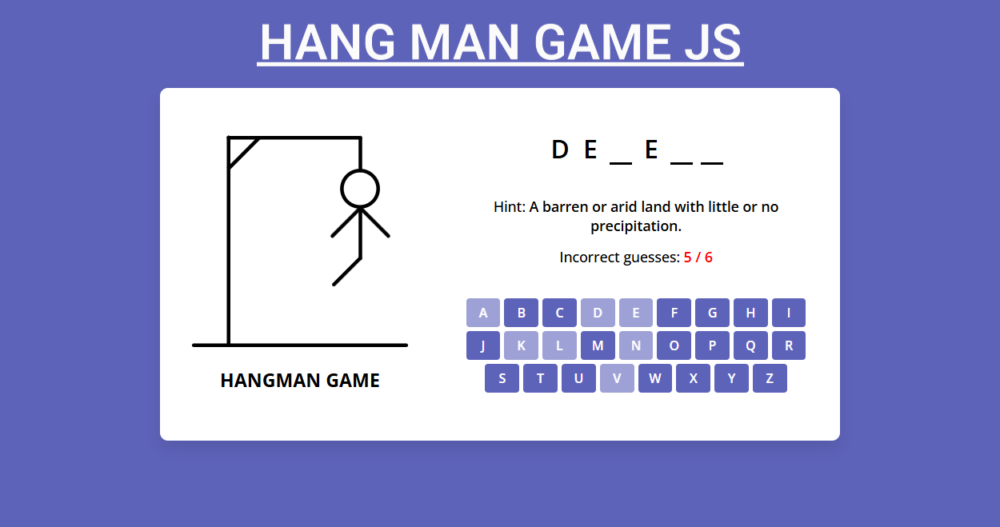

# Hangman Game

A simple **Hangman** game built using **HTML, CSS, and JavaScript**. Try to guess the hidden word before you run out of attempts!

## 🚀 Features
- Interactive UI with animations
- Random word selection
- Keyboard input support
- Tracks remaining attempts
- Responsive design for different screen sizes

## 📸 Preview
 

## 🎮 Demo
[Live Demo](https://hangmangame-polly.netlify.app/) 

## 🛠️ Installation
1. **Clone the repository**
   ```sh
   git clone https://github.com/iamdashdev/Hangman-game.git
   ```
2. **Navigate to the project folder**
   ```sh
   cd Hangman-game
   ```
3. **Open the `index.html` file in your browser**

## 📜 How to Play
1. A random word is chosen, and blanks are displayed.
2. Click on letters or use your keyboard to guess the word.
3. Each incorrect guess reduces the number of attempts.
4. Guess the word before you run out of attempts to win!

## 🏗️ Project Structure
```
/hangman-game
│-- index.html    # Main HTML file
│-- style.css     # Styling for the game
│-- script.js     # Game logic in JavaScript
│-- assets/       # Images and other assets
```

## 🧑‍💻 Technologies Used
- HTML
- CSS
- JavaScript

## 📜 License
This project is open-source and available under the **MIT License**.

## 🤝 Contributing
Contributions are welcome! Feel free to fork the project and submit a pull request.

## ⭐ Acknowledgments
- Inspired by classic Hangman games
- Thanks to OpenAI's ChatGPT for helping structure this README

---
Made with ❤️ by [Polly Mwangi](https://github.com/iamdashdev)

